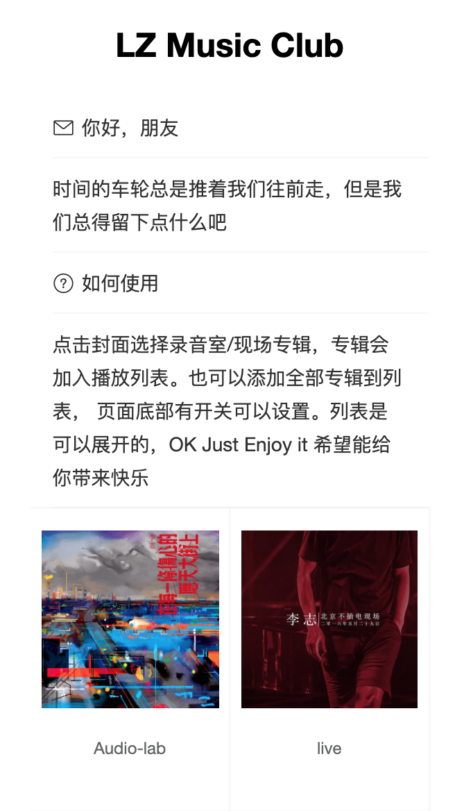
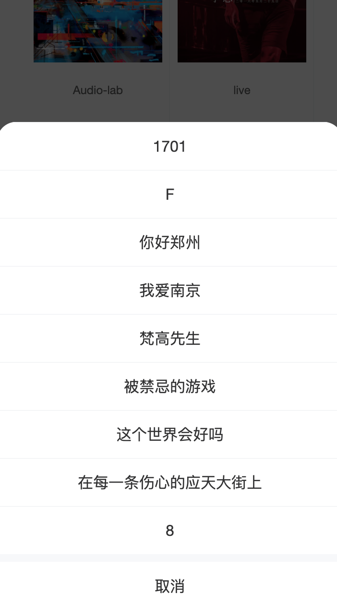
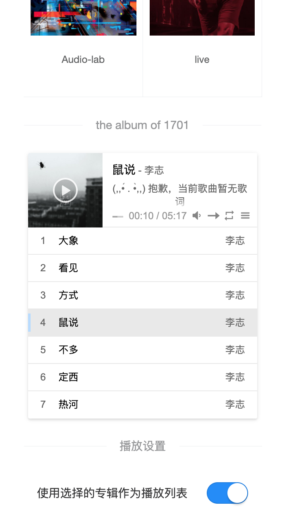

# vue-music-player

基于vue和[vue-aplayer](https://github.com/MoePlayer/vue-aplayer)的简单音乐播放器

使用[vant](https://github.com/youzan/vant)作为样式框架

无后端服务器，基于nginx暴露出静态json文件作为数据来源。

献给我们曾经度过的青春。

## 页面预览




点击封面选择歌曲



-----------------------------------------------


选择专辑进行播放

## 开始

```
// Project setup
npm install

// Compiles and hot-reloads for development
npm run serve

// Compiles and minifies for production
npm run build

// Run your tests
npm run test

// Lints and fixes files
npm run lint
```
## TODO

- 取消json文件，增加后端支持
- 增加歌词数据

## 致谢

项目前身源于：https://github.com/sjx1995/vue-music-player

